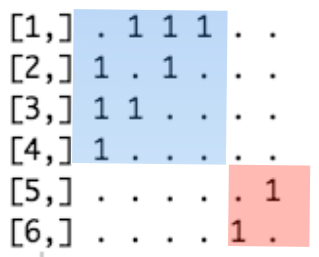
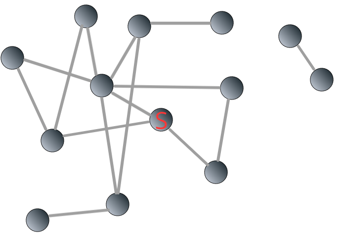

# Small World Phenomenon{#SmallWorld}

```{block2, type='rmdnote'}
The following is not originally from me, but my notes from reading [*Network Science*](http://networksciencebook.com/) (Ch. 2.6-2.10) by [Albert-László Barabási](https://barabasi.com/). Notes are accompanied by my explanations. 
```

Before we can understand the small world phenomenon, we need to have more basic knowledge about a network: shortest path, average path length, Breath-first search algorithm, components, and local and average clustering coefficient. 

## Weight, paths, connectedness, and clustering
### Weighted network
So far, we assumed that the weight of all links in a network is the same. However, networks can be weighted. Take social network as an example. Although you are connected to many people, the weight of these connections is unequal. You probably talk to your family and your close friends more often than to your acquaintances. In an adjacency matrix, suppose you are represented by node $i$, your mom node $j$ and one of your acquaintances node $m$. Also suppose the weight of the link between you and your mom is $10$, which is ten times the weight of the link between you and the acquaintance. Then we have $A_{ij} = 10$ and $A_{im} = 1$. 

### Shortest path, network diameter, and average path length

#### Shortest path
In real world, objects have physical distances between each other, and that's why you need to fly for three hours from New York to Florida. In networks, physical distances are replaced by **path lengths**: how many links does the path contain?

For example, in `g1`, the path length between node $1$ and node $4$ can either be 2 ($1 \to 3 \to 4$) or 3 ($1 \to 2 \to 3 \to 4$):

```{r}
par(mar = c(1, 1, 1, 1))
plot(g1)
```

Obviously, the path length of $2$ is smaller than $3$. In this case, $1 \to 3 \to 4$ is the **shortest path** (denoted as $d_{i,j}$), which is defined as the path with the fewest number of links. In the above example, $d_{1,4}$ = 2.

In an undirected network, $d_{i,j} = d_{j,k}$. This often does not hold true in a directed network because:

1. The existence of $(i, j)$ does not guarantee the existence of $(j, i)$;

2. Even if both $(i, j)$ and $(j, i)$, the two often are unequal to each other. 

For example,

```{r g3, fig.cap="shortest paths in a directed network", fig.align='center'}
g3 <- graph( edges=c(1,2, 1,3, 2,3, 3,4, 4,2), n=4, directed=TRUE)
par(mar = c(1, 1, 1, 1))
plot(g3)
```

There are paths ($1 \to 2$, and $1 \to 3 \to 4 \to 2$) from node $1$ to node $2$ but we don't have on any from node $2$ to node $1$. Furthermore, $d_{2, 4} = 2$ whereas $d_{4,2} = 1$. 

```{block2, type='rmdimportant'}
Please note that all the above discussions on shortest path lenghts are based on the assumption that it is a simple contagion. In a complex contagion, things are very different because multiple reinforcements are necessary. Read @centola2007complex for more detailed explanations. 
```

#### Network diameter
Among all the shortest paths in a network, the longest one is called the **diameter** of this network, denoted as $d_{max}$. In the above Network \@ref(fig:g3), $d_{max} = 2$: $d_{1,4} = d_{2,4} = 2$.

#### Average path length
Average path length is defined as the average length of shortest paths between any two nodes. For example, in Network \@ref(fig:g3), $d_{1,2} = d_{1,3} = d_{2,3} = d_{3,4} = d_{4,2} = 1$, $d_{1,4} = d_{2,4} = d_{3,2} = d_{4,3}  = 2$. Therefore, the average is $\frac{(1 \cdot 5 + 2 \cdot 4)}{5 + 4} = 1.44$. Lets test it:

```{r}
average.path.length(g3)
```

#### Breath-first search (BFS) algorithm
As the size of a network gets larger, it will be more difficult to know what is the shortest path between a pair of nodes. For example, without using computers, 

For example, in the network \@ref9fig:random3-10 below, what is the shortest path from node $3$ to node $90$?

```{r random3-1, fig.align='center', fig.cap="A random network to explain Breath-first search (BFS) algorithm", out.width="100%"}
set.seed(42)
random3 <- erdos.renyi.game(100, 0.1, type = "gnp")
plot(random3)
```

We are not even sure whether the two nodes are connected or not, let alone knowing the shortest path. Of course, computers can do this very fast:

```{r}
shortest_paths(random3, from = 3, to = 90)
```

From the result, we know that $d_{3, 90} = 3$. The path is: $3 \to 8 \to 28 \to 90$. But how did the computer find this path? 

The most frequently used algorithm to find the shortest path between two nodes is called "Breadth-First Search (BFS)". It starts from the "source" node, which is labeled as $0$. Neighbors of the "source" node is then labeled as $1$, then the neighbors' neighbors, until it reaches the "target" node. 

For example, we are interested in knowing the shortest path from the source node ("S") to the target ("T") in the following Network \@ref(fig:bfs01):

```{r bfs01, echo=FALSE, fig.align='center', fig.cap="Illustrating breadth-first search algorithm: source and target", fig.width = 100, out.width = "55%"}
knitr::include_graphics('images/bfs01.png')
```

The breadth-first search algorithm is shown in Figure \@ref(fig:bfs) below:

```{r bfs, echo=FALSE, fig.align='center', fig.cap="Illustrating breadth-first search algorithm: steps", fig.width = 100, out.width = "50%", fig.show='hold'}
knitr::include_graphics(c('images/bfs02.png', 
                          'images/bfs03.png',
                          'images/bfs04.png'))
```

We can see that the shortest path from the "source" to the "target" is $3$. 

### Connectedness
In a disconnected network, subnetworks are called *components* or *clusters*. A *bridge* can connect two components. 

For a large network, there are two ways to find out whether it consists of *components*:

1. Using linear algebra to look at the network's adjacency matrix could be rearranged into a block diagonal;

2. Using BSF algorithm. 

For example, in Figure \@ref(fig:disconnected), the network contains two components:

```{r disconnected, fig.align='center', fig.cap="An example of disconnected network"}
disconnectedG <- graph( edges=c(1,2, 1,3, 2,3, 1,4, 5,6), 
                        n=6, 
                        directed=FALSE)
par(mar = c(1, 1, 1, 1))
plot(disconnectedG)
```

In its adjacency matrix, nonzero elements are contained in square blocks along the diagonal and all the remaining elements are zeros:

```{r BDmatrix, echo = FALSE, fig.align='center', fig.cap="Adjacency matrix of the disconnected network", out.width="45%"}

```

If the components are bridged:

```{r blockDiagonal02, fig.align='center', fig.cap="An example of connected network"}
connectedG <- graph( edges=c(1,2, 1,3, 2,3, 1,4, 3,5, 5,6), n=6, 
                     directed=FALSE)
par(mar = c(1, 1, 1, 1))
plot(connectedG)
```

Then its adjacency matrix cannot be rearranged in a block diagonal form:

```{r echo=FALSE}
as_adjacency_matrix(connectedG)
```

Then how can we find whether a network is connected or disconnected using BFS algorithm? 

It's very easy. In a connected network, we can reach all the nodes from the "source node". Therefore, the number of labeled nodes is equal to the size of the network, $N$. However, in a disconnected network, nodes in different components cannot be reached, so the number of labeled nodes is smaller than $N$. 

To illustrate, let's go back to the network \@ref(fig:bfs01). This time, we add a component consisting two nodes to it.

```{r bfsD1, echo=FALSE, fig.align='center', fig.cap='A disconnected network composed of two components',out.width="65%"}

```

We apply BFS algorithm to the network \@ref(fig:bfsD1). The starting point is the same as above. You can see that the process ceased when the label reaches $3$:

```{r bfsD2, echo=FALSE, fig.align='center', fig.cap='BFS stops in a disconnected network',out.width="65%"}
knitr::include_graphics("images/bfsD2.png")
```

How can we identify the remaining component(s)? In the example above, we assign label $4$ to a randomly unlabeled node $j$ and all the other nodes reachable from node $j$.

```{r bfsD3, echo=FALSE, fig.align='center', fig.cap='Identifying components in a disconnected network through BFS algorithm',out.width="65%"}
knitr::include_graphics("images/bfsD3.png")
```

What if there are multiple components? It's the same as the above step. After labeling all reachable nodes, if the number of labeled nodes is still smaller than $N$, then we assign label $5$ to a randomly unlabeled node $m$, and all other nodes reachable from node $m$. The process goes on until the number of labeled nodes is equal to $N$. 

### Clustering coefficient
To what degree are a node's neighbors connected with each other? That's what clustering coefficient measures. 

If the degree of node $i$ is $k_i$, then node $i$'s **local clustering coefficient** is defined as

\begin{equation}
\begin{split}
  C_i & = L_i ÷ \frac{k_i \cdot (k_i - 1)}{2} \\
  & = \frac{2 \cdot L_i}{k_i \cdot (k_i - 1)}
\end{split}
(\#eq:localClustering)
\end{equation}

$L_i$ represents the actual number of links between node $i$'s $k_i$ neighbors, and $\frac{k_i \cdot (k_i - 1)}{2}$ means the highest number of links possible between those neighbors. 

**Local clustering coefficient** of a node is the probability that two neighbors of a given node has a link to each other. It measures the local density of links in a network. 

**Local clustering coefficient** is for nodes. If we are interested in the degree of clustering for a network, we need to calculate **average clustering coefficient**, denoted as $\langle C \rangle$ which is simply the average of local clustering coefficient of all the nodes in a given network:

\begin{equation}
   \langle C \rangle = \frac{1}{N} \cdot \sum_{i = 1}^N C_i
(\#eq:avergeClustering)
\end{equation}

## Chapter 3 Homework
```{block2, type='rmdnote'}
This part is based on Professor YY's module 3 assignment of [shortest path length distribution](https://github.com/yy/netsci-course/blob/master/m03-smallworld/shortest_path_length_distribution.ipynb).
```

You can find the homework [here](https://github.com/yy/netsci-course/blob/master/m03-smallworld/shortest_path_length_distribution.ipynb).
