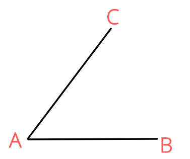

# Weak Ties and Watts-Strogatz model
In this chapter, we are going to learn how to generate random networks. Then, we will study some important characteristics of random networks, such as average degree, and degree distribution. We are also going to read two of the most influential papers and get an idea of weak ties and Watts-Strogatz model. 

## Random networks (Barabási Ch.3)

```{block2, type='rmdnote'}
The following is not originally from me, but my notes from reading [*Network Science*](http://networksciencebook.com/) (Ch. 3) by [Albert-László Barabási](https://barabasi.com/). Notes are accompanied by my explanations. 
```

### Generating a random network 
Most of networks in real life look like randomly constructed. Then, how can we, as humans, produce random networks that we see in nature? 

Simply by putting links randomly between nodes. 

But how can we make sure that we are putting links **randomly**?

Think about it for a minute before reading on. 

If you have studied statistics, you would know that **randomness** is all about **probability**. If we say that we are going to **randomly** pick a person from a group, then we'll need to make sure that **each** person in the group has an **equal** chance to be picked. Otherwise, the choice is not **random**. 

Now, let's go back to our original problem: how can we **randomly** put links between nodes? 

For example, we now have 100 isolated nodes, which are called **singletons**, as shown below. What to do next?

```{r g4-1, fig.align='center', fig.cap="100 isolated nodes",out.width="100%"}
g4_1 <- graph( edges=NULL, n=100)
plot(g4_1)
```

Frist, we'll set up a value *p* ($0 \leq p \leq 1$), called **link probability**. Then, we'll pick a pair of nodes (STEP 1), for example, $i$ and $j$, and generate a ramdom number $r$ for this pair (STEP 2). If $r < p$, then we connect $i$ and $j$. Otherwise, we keep them disconnected. We'll repeat step 1 and step 2 for all node pairs, the total number of which should be $\frac{N(N-1)}{2}$. This way, we will make sure that the probability of each pair being connected is exactly $p$. Why so?

```{r 1-9, fig.align='center', fig.cap="Illustrating why the probability of each pair being connected is equal to the link probability"}
plot(c(0, 1), c(0, 0.2), 
     type= "n", 
     xlab = "", 
     ylab = "", 
     yaxt="none")
# Solution: https://rstudio-pubs-static.s3.amazonaws.com/
# 297778_5fce298898d64c81a4127cf811a9d486.html
abline(v=0.1, col="red")
rect(0,0,0.1,0.2,col="lightgreen")
rect(0.1,0,1,0.2,col="red")
```

The reason can be shown in Figure \@ref(fig:1-9). If we set $p = 0.1$, then only $10\%$ of random numbers will fall in the range of $[0,0.1)$ (the area shown in light green), the remaining $90\%$ will fall in $[0.1,1]$^[I am a little bit uncertain here because I don't know where to put 0.1.].

Okay, let's set $p=0.1$ and see what will happen:

```{r erdosRenyi, fig.align='center', fig.cap="An Erdős-Rényi network", out.width="100%"}
# Solution from: https://rpubs.com/lgadar/generate-graphs
set.seed(42)
erdosRenyi <- erdos.renyi.game(100, 0.1, type = "gnp")
plot(erdosRenyi)
```

The method described above is used in a model called **$G(N,p)$ model**, which was introduced independently by Edgar Nelson Gilbert. In this model, the number of nodes ($N$), and link probability ($p$) are fixed. 

There is a similar model called **$G(N,L)$ model** where the number of nodes and the number of links are fixed. This model was introduced by Pál Erdős and Alfréd Rényi. 

In practice, we use **$G(N,p)$ model** more. But since Pál Erdős and Alfréd Rényi played such an important rold in advancing our understanding of random networks, we still name networks generated by the **$G(N,p)$ model** as an **Erdős-Rényi network**.

```{block2, type='rmdcaution'}
In [Chapter 3.2](http://networksciencebook.com/chapter/3#random-network) of [*Network Science*](http://networksciencebook.com/) , there is a mistake: the second step of generating a random network said that "if the number exceeds $p$, connect the selected node pair with a link". However, it should be "if the number is smaller than p, connect the selected node pair with a link."
```

### Average degree, and the expected number of links in a random network
We can think of the process of first generating a random number for a pair of nodes, then comparing it with $p$, and finally deciding whether to link the pair or not as tossing a coin [@menczer2020first].

Imagine we have a biased coin which gives us heads with probability $p$, which is equal to the **link probability** we talked about before. Take $p=0.1$ as an example. If we toss the coin for ten times, then we are expecting $10*0.1=1$ head, right? For the same token, when we have $100$ tosses, we will be expecting $10$ heads. 

In the procudure of random network generation discussed above, we concluded that a pair of nodes being connected has a probability of $p$, which is the same as the probability of us having a head when we toss a coin. Since we are expecting $10$ heads out of $100$ tosses, then how many connected pairs of nodes are expected, or, how many links are expected, if we examine $100$ pairs? $10$, right?

How do we get this number? We simply multiply the total number of tosses in the case of flipping coins (or the total number of pairs of nodes we have in the case of random network generation) by $p$. 
Now, in the $G(N,p)$ model, we have $N$ nodes. It's easy to understand that we will have ${N \choose 2} = \frac{N(N-1)}{2}$ pairs of nodes to examine. So, **the number of links we are expecting in this random network** is:

\begin{equation}
  \langle K \rangle = \frac{N(N-1)}{2}p (\#eq:average-L)
\end{equation}

$\langle L \rangle$ here stands for the **expected value**. A given random network generated by $G(N,p)$ does not necessarily have exactly $\frac{N(N-1)}{2}p$ links. But as we generate more and more random networks using the $G(N,p)$ model, the average number of links will be $\frac{N(N-1)}{2}p$. That's what we mean by **expected value**. You can look at **Image 3.3** in [*Network Science*](http://networksciencebook.com/) for examples and illustrations. 

Then, in this random network, what is the **average degree**? 

Recall Eq. \@ref(eq:AverageDegree). Replacing $L$ with $\langle L \rangle$ from Eq. \@ref(eq:average-L), we have:

\begin{equation}
  \langle k \rangle = \frac{2\langle L \rangle}{N} = p(N-1) (\#eq:average-D)
\end{equation}

```{block2, type='rmdtip'}
How to remember Eq. \@ref(eq:average-D): 
  
The average degree of a random network is the product of $p$, the **link probability**, and $(N-1)$, the maximum number of links (or neighbors) a node can have.
```

You can read [Ch. 3.3](http://networksciencebook.com/chapter/3#number-of-links) of [*Network Science*](http://networksciencebook.com/) for more detailed mathematical reasoning. 

### Degree distribution
#### Binomial distribution
First of all, if you are not familiar with combinations and permutations, or that you have forgotten what you learnt in your high school, you are encouraged to go through [this amazing tutorial](https://www.mathsisfun.com/combinatorics/combinations-permutations.html) on [mathsisfun.com](https://www.mathsisfun.com/).

Then, carefully read throught [this tutorial on binomial distribution](https://www.mathsisfun.com/data/binomial-distribution.html). 

If you are able to understand the tutorials above, then you should know that if we have a biased coin which produces heads with probability $p$, the probability of having $k$ heads out of $n$ tosses is:

\begin{equation}
  {n \choose k}p^k(1-p)^{n-k} (\#eq:coin-tossing-binomial)
\end{equation}

How to understand it?

We can look at it this way: tossing a coin $n$ times, we have $2^n$ different outcomes (i.e., combinations of heads and tails), and the number of outcomes (or combinations, if you want) that have $k$ heads is $n\choose k$ outcomes. However, we cannot simply use ${n\choose k}\div{2^n}$ to calculate the probability of having $k$ heads. Why? Because this is a **biased** coin, so each outcome (or combination) has different probabilities. 

What should we do then?

Now we know the number of outcomes that will produce $k$ heads out of $n$ tosses. It will be great if we know the probability of each of these outcomes and sum them up. Bingo!

When we think more deeply, we will know that each of these $n\choose k$ outcomes has exactly the same probability: $p^k(1-p)^{n-k}$. But why? Read [this tutorial on binomial distribution](https://www.mathsisfun.com/data/binomial-distribution.html) again, especially the tree diagram. Also, you'll find [this tutorial](https://www.mathsisfun.com/data/probability-events-independent.html) on the probability of independent events helpful. 

Now, let's go back to random networks. 

Table: (\#tab:network-and-coin) Comparing random network generation and flipping coins

|  | $p$   | $N$      | $k$  |
|---------|--------------|------|----------|
| random network generation | link probability | number of nodes | number of node pairs successfully connected | 
| tossing coins     | probability of having a head in one toss  | number of tosses      | number of heads   |  

For a given node $i$, the maximum number of links it can have is $N-1$. Let's denote the probability of node $i$ having $k$ links as $p^k$. Eq. \@ref(eq:coin-tossing-binomial), we know that:

\begin{equation}
  p^k = {N-1 \choose k}p^k(1-p)^{N-1-k} (\#eq:random-network-binomial)
\end{equation}

In this binomial distribution, the mean is:

\begin{equation}
  E(x) = Np (\#eq:binomial-mean)
\end{equation}

Its standard deviation is:

\begin{equation}
  \sigma_i = [p(1-p)N]^\frac{1}{2} (\#eq:binomial-sd)
\end{equation}

And its second moment is:

\begin{equation}
  E(x^2) = p(1-p)N + p^2N^2 (\#eq:binomial-2nd-moment)
\end{equation}

Sorry that I am currently not capable of proving Eq. \@ref(eq:binomial-mean) to Eq. \@ref(eq:binomial-2nd-moment). For now, just memorize them. 

#### Poisson distribution
Most real networks are sparce, so its average degree $\langle k \rangle$ is much smaller than the size of the network, $N$. Considering this limit, we usually use Poisson distribution to describe a random network's degree distribution because of simplicity:

\begin{equation}
  p_k = e^{-\langle k \rangle}\frac{\langle k \rangle^k}{k!} (\#eq:poisson)
\end{equation}

Eq. \@ref(eq:random-network-binomial) and Eq. \@ref(eq:poisson) are collectively called **degree dostribution of a random network**. 

Something needs remembering:

1. Binomial form is the exact version; Poisson distribution is only an approximation;

2. We'd better use Binomial distribution to describe a small network, for example, $N = 10^2$, but use Poisson distribution for large networks, for example, $N = 10^3$ or $10^4$;

3. In Poisson distribution, the standard deviation is $\sqrt {\langle k \rangle}$;

4. The Poisson distribution tells us that for two networks, as long as they have the same $\langle k \rangle$, their degree distribution is almost exactly the same despite different sizes, i.e., $N$. 

```{block2, type='rmdreminder'}
I did not quite understand the lecture on the Poisson distribution by Professor YY.  
```

### Poisson distribution does not capture reality

Poisson distribution undoutedly accurately describes the degree distribution of random networks, but we need to ask, do random netwoks reflect reality? 

Reading [Ch. 3.5](http://networksciencebook.com/chapter/3#not-poisson), will let us know that if random networks can describe social networks in our daily lives, we would expect that:

1. Most people will have $\langle k \rangle \pm \sqrt {\langle k \rangle}$ friends;

2. The highest number of friends a person can have is not that different than the smallest possible number. 

However, we know that this is not the case in real life. Many people have over 5,000 contacts on Facebook and WeChat. 

From the figure shown in [Ch. 3.5](http://networksciencebook.com/chapter/3#not-poisson), we will know that in real networks, both **the number of high degree nodes**, and **the standard deviation of the distribution**, are much larger than what is expected from random networks. 

## Reading two seminal papers

### *The Strength of Weak Ties* by @granovetter1973strength

Please read the following articles carefully by yourself before reading my notes.

Granovetter, M. S. (1973). [The strength of weak ties](https://www.cs.cmu.edu/~jure/pub/papers/granovetter73ties.pdf). *American journal of sociology, 78*(6), 1360-1380.

This is a highly influential paper: more than 58K as of Nov. 2020. 

- Overlap in friendship circles: Suppose there are two individuals, *A* & *B*, and a group of people, *S* = *C*, *D*, *E*. The stronger the tie between *A* and *B*, the more people in Group S will be tied to **both** A and B. 

- If there is a strong tie between $A$ and $B$, and between $A$ and $C$. It's very likely that $B$ and $C$ also are friends, because

  1. A common contact will bring $B$ and $C$ into interaction;
  2. The stronger the tie, the more similar are individuals to each other. $A$ is similar to $B$, and $A$ is similar to $C$, and thus $B$ is similar to $C$, making it more likely for them to be friends; and 
  3. If $B$ and $C$ are aware of each other but are not friends, they might have a "psychological strain" since their feelings are not consistent with $A$. 
  
Therefore, this tried in Figure \@ref(fig:tried) is very unlikely to occur:

```{r tried, echo = FALSE, fig.align='center', fig.cap="An impossible tried, adapted from Fig.1 of Granovetter (1973)", out.width="45%"}

```

- A bridge is a link connecting two otherwise disconnected groups. "No strong tie is a bridge". All bridges are weak ties. 

- A local bridge of $n$: if this bridge does not exist, what is the shortest path between these two points?

- No strong tie is a local bridge. 

- Whatever is is to be diffused can reach a larger number of people if passed through weak rather than strong ties^[@centola2007complex advanced this idea by distinguishing between complex contagions and simple contagions like an epidemic. They argued that the strength of weak ties should not be simply generalized to complex contagions, which require affirmation from multiple sources. Therefore, not only the length, but also, and maybe more importantly, the width of the ties influences complex contagions.]. 

- People are more likely to find jobs through weak ties rather than strong.

```{block2, type='rmdreminder'}
Something I do not understand yet in this paper: 
"Thus, network fragmentation, by reducing drastically the number of paths from any leader to his potential followers, would inhibit trust in such leaders."
```

### Watts-Strogatz model of small world

Please read the following paper:

Watts, D. J., & Strogatz, S. H. (1998). [Collective dynamics of ‘small-world’networks](http://materias.df.uba.ar/dnla2019c1/files/2019/03/watts-collective_dynamics-nature_1998.pdf). *Nature, 393*(6684), 440-442.

It's another canonical study in the field of network science, also highly influential. 

[Here](https://dwulff.github.io/_Networks/Downloads/watts_strogatz.html) is an amazing tutorial & practice to understand WS model. And [here](http://worrydream.com/ScientificCommunicationAsSequentialArt/) is another one I found.
